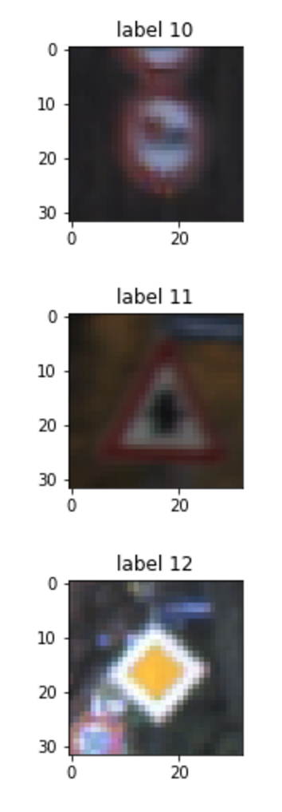
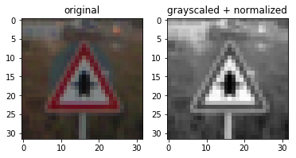

#**Traffic Sign Recognition** 

##Writeup

---

**Build a Traffic Sign Recognition Project**

The goals / steps of this project are the following:
* Load the data set (see below for links to the project data set)
* Explore, summarize and visualize the data set
* Design, train and test a model architecture
* Use the model to make predictions on new images
* Analyze the softmax probabilities of the new images
* Summarize the results with a written report

## Rubric Points
###Here I will consider the [rubric points](https://review.udacity.com/#!/rubrics/481/view) individually and describe how I addressed each point in my implementation.  

---
###Data Set Summary & Exploration

####1. Provide a basic summary of the data set and identify where in your code the summary was done. In the code, the analysis should be done using python, numpy and/or pandas methods rather than hardcoding results manually.

The code for this step is contained in the second code cell of the IPython notebook.  

I used regular python / numpy code to calculate summary statistics of the traffic
signs data set:

* The size of training set is 34799
* The size of test set is 12630
* The shape of a traffic sign image is (32, 32, 3) - width and height are 32 pixels and each pixel has 3 colors.
* The number of unique classes/labels in the data set is 43

####2. Include an exploratory visualization of the dataset and identify where the code is in your code file.

The code for this step is contained in the third code cell of the IPython notebook.  

I chose to visualize the dataset by selecting the first occurrence of each label and showing the image. Here is a fragment
of the full 43 labeled images:

See all labeled 43 images [here](Traffic_Sign_Classifier.html#Include-an-exploratory-visualization-of-the-dataset).

###Design and Test a Model Architecture

####1. Describe how, and identify where in your code, you preprocessed the image data. What techniques were chosen and why did you choose these techniques? Consider including images showing the output of each preprocessing technique. Pre-processing refers to techniques such as converting to grayscale, normalization, etc.

The code for this step is contained in the fourth code cell of the IPython notebook.

As a first step I converted all images to grayscale by summing up all 3 colors (red,green,blue) of each pixel. This
allows the network to recognize the images regardless of the individual colors, but their shape. The resulting
net might actually be able to recognize traffic signs of different colors.

As a second step I applied feature scaling. With this dataset it wouldn't be strictly necessary, but is considered good
practice in machine learning and is absolutely important when there are a lot of features using different scales.

The important bit was to save the calculated max/min values of the training set and apply them to all the sets in the
same manner.

You can see an example of a converted image here (using a traffic sign from Frankfurt, Germany):

####2. Describe how, and identify where in your code, you set up training, validation and testing data. How much data was in each set? Explain what techniques were used to split the data into these sets.

The code for splitting the data into training and validation sets is contained in the fifth code cell of the IPython notebook.  

Since the pickled data was already split up into 3 sets (training set, validation set and test set) a manual split was
not necessary.

My final training set had 34799 number of images. My validation set and test set had 4410 and 12630 number of images.

I decided to go with the given original data since I believed it would be enough to cross the 93% accuracy threshold.

####3. Describe, and identify where in your code, what your final model architecture looks like including model type, layers, layer sizes, connectivity, etc.) Consider including a diagram and/or table describing the final model.

The code for my final model is located in the seventh cell of the ipython notebook. 

My final model is very similar to the model of LeNet, but contains two major differences:
1. I widened the network by a factor of 5. This means that I have 5 times as many neurons than LeNet in each layer. This
means my net is capable of fitting more complex functions.
2. Since this design would likely lead to overfitting, I added a dropout layer with factor 0.5 after the first fully
connected layer.

| Layer         		|     Description	        					| 
|:---------------------:|:---------------------------------------------:| 
| Input         		| 32x32x1 grayscaled + feature scaled image   	| 
| Convolution 5x5     	| 1x1 stride, valid padding, outputs 28x28x30 	|
| RELU					|												|
| Max pooling	      	| 2x2 stride,  outputs 14x14x30 				|
| Convolution 5x5	    | 1x1 stride, valid padding, outputs 5x5x80		|
| RELU					|												|
| Fully connected		| input 2000, output 600        				|
| RELU					|												|
| Dropout				| keep probability of 0.5 during training		|
| Fully connected		| input 600, output 420        				    |
| RELU					|												|
| Fully connected out	| input 420, output 43        				    |
| Softmax				| softmax using one-hot encoded labels        	|

####4. Describe how, and identify where in your code, you trained your model. The discussion can include the type of optimizer, the batch size, number of epochs and any hyperparameters such as learning rate.

The code for training the model is located in the eigth cell of the ipython notebook. 

In the end I used nearly the same parameters of the LeNet example: A learning rate of `0.001`, an adam optimizer,
a batch size of `128` and `10` epochs. In addition I added a parameter called `net_multiplier` that I use to widen each
network layer with a value of `5`, and I used `0.5` for the keep probability of the dropout layer.

####5. Describe the approach taken for finding a solution. Include in the discussion the results on the training, validation and test sets and where in the code these were calculated. Your approach may have been an iterative process, in which case, outline the steps you took to get to the final solution and why you chose those steps. Perhaps your solution involved an already well known implementation or architecture. In this case, discuss why you think the architecture is suitable for the current problem.

The code for calculating the accuracy of the model is located in the ninth cell of the Ipython notebook.

My final model results were:
* training set accuracy of 0.999
* validation set accuracy of 0.963
* test set accuracy of 0.948

Here is how I implemented the model:

1. First off I implemented the LeNet example and ran it on the training set. This way I already achieved a test set
accuracy of around 87%. I considered this to be a good starter since it already uses convolutional layers. Also, LeNet
was developed on 32x32 MNIST images with 10 labels (images of 0 to 9), so it was already pretty similar to the given
 traffic set data (with 32x32 images and 43 labels).
2. After that I played around with the learning rate. I increased it in order to increase the speed of the learning
process, but this lead to a decrease in the test set accuracy. I ended up using the same learning rate as before.
3. I increased the number of epochs. But the validation accuracy stayed the same approximately, so I reverted it to 10.
4. I tried to widen the first two convolutional layers. This increased the test set accuracy, but only up to 90%.
5. Then I tried to add another fully connected layer - with near to no change.
6. Then I thought: Hmm, the traffic set has 43 labels, but LeNet has only 10. So maybe I have to widen the network to fit
a more complex hypothesis? To achieve this I added my own hyperparameter `net_multiplier = 5` and applied it to the whole LeNet
architecture, effectively widening each layer by a factor of 5. This way I ended up at approx. 92% test set accuracy.
7. By printing out the train set and the validation set accuracy after each epoch, I learned that my model was near 0.999
train set accuracy already after the 3rd or 4th epoch - but the validation accuracy stayed pretty low. This indicated that
my model was already capable of learning the full test set, but was overfitting too much.
8. I added a dropout layer with a `keep_prob = 0.5` to reduce overfitting. This way I achieved around 95% accuracy on the test set.

###Test a Model on New Images

####1. Choose five German traffic signs found on the web and provide them in the report. For each image, discuss what quality or qualities might be difficult to classify.

Here are five German traffic signs that I found on the web:

Apart from the second (no entry) sign I didn't expect the images to be difficult to qualify because the quality of all
images is pretty high. The no entry sign however is skewed, which might be a problem if the training set does not contain
skewed no entry signs.

####2. Discuss the model's predictions on these new traffic signs and compare the results to predicting on the test set. Identify where in your code predictions were made. At a minimum, discuss what the predictions were, the accuracy on these new predictions, and compare the accuracy to the accuracy on the test set (OPTIONAL: Discuss the results in more detail as described in the "Stand Out Suggestions" part of the rubric).

The code for making predictions on my final model is located in the tenth cell of the Ipython notebook.

Here are the results of the prediction:

| Image			        |     Prediction	        					| 
|:---------------------:|:---------------------------------------------:| 
| Stop Sign      		| Stop sign   									| 
| No entry    			| No entry 										|
| Stop Sign      		| Stop sign   									| 
| Yield					| Yield											|
| Right of way at next intersection | Right of way at next intersection	|

The model was able to correctly guess 5 of the 5 traffic signs, which gives an accuracy of 100%. This compares favorably to the accuracy on the test set of approx. 95%.

####3. Describe how certain the model is when predicting on each of the five new images by looking at the softmax probabilities for each prediction and identify where in your code softmax probabilities were outputted. Provide the top 5 softmax probabilities for each image along with the sign type of each probability. (OPTIONAL: as described in the "Stand Out Suggestions" part of the rubric, visualizations can also be provided such as bar charts)

The code for making predictions on my final model is located in the 11th cell of the Ipython notebook.

My model predicted all traffic signs correctly. The top five soft max probabilities were

| _P1_ |  P2 |  P3 |  P4 |  P5 | 
|:-----------:|:-----------:|:-----------:|:-----------:|:-----------:|
|1.00 Stop| 0.00 Keep right| 0.00 Turn right ahead| 0.00 Turn left ahead| 0.00 No entry|
|1.00 No entry| 0.00 Turn left ahead| 0.00 Stop| 0.00 Keep right| 0.00 No passing|
|1.00 Stop| 0.00 Turn right ahead| 0.00 Speed limit (120km/h)| 0.00 Turn left ahead| 0.00 Keep right|
|1.00 Yield| 0.00 Ahead only| 0.00 No passing for vehicles over 3.5 metric tons| 0.00 No passing| 0.00 No vehicles|
|1.00 Right-of-way at the next intersection| 0.00 Pedestrians| 0.00 Beware of ice/snow| 0.00 Double curve| 0.00 General caution|

Based on these results my model is *really* certain about its predictions.
